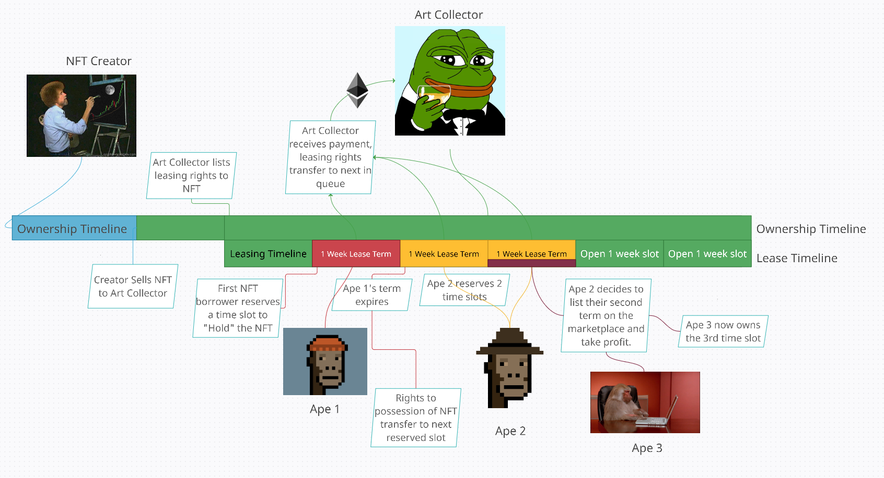
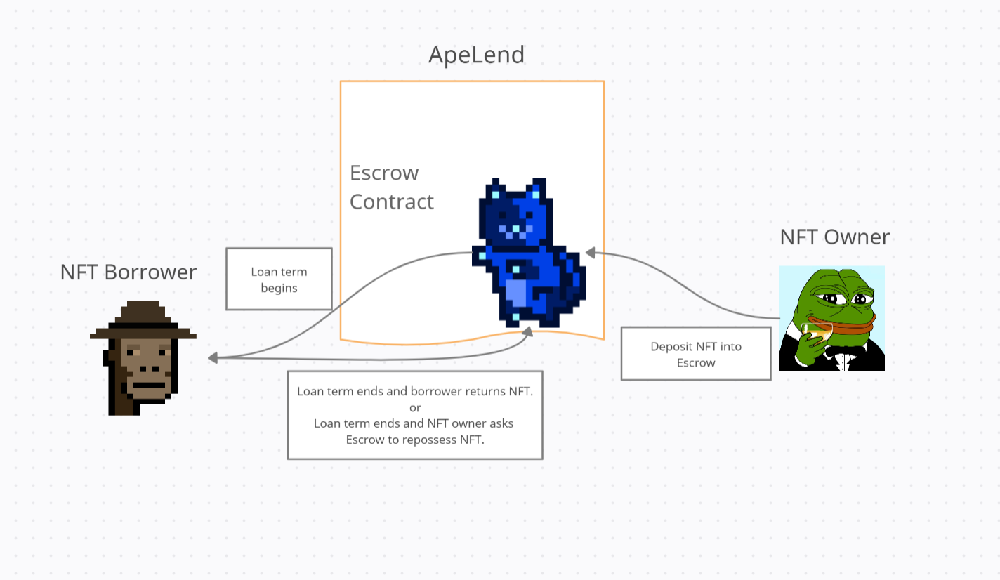

# ApeLend
### NFTs have trouble competing with DeFi’s passive yield. The lack of fungibility makes it more difficult to assign proper value.
### So we attempted to provide a solution through a borrowing and lending marketplace.
#
### An NFT owner can use the platform to get yield on their portfolio.
### While an enthusiast can lease a piece of history much like a gallery or museum.
#  
### Diagram below is an example of how the ownership and possession timelines of the NFT work.

# 
### The NFT is brought into existance by the creator, then sold to an art collector. This is the standard process, but ApeLend adds another layer here with the Leasing Timeline. If the art collector proceeds to list it on our marketplace, they are maintaining the claim on the NFT, but now they can extract more value from its ownership through leasing rights.
# 
### Enthusiasts/Apes can purchase lease agreements for bragging rights or other perks associated with the NFT without having to use as much money to do it.
# 
### This maybe difficult to achieve if it requires trust in the borrower's willingness and ability to return it, so we implemented a repossession mechanism outlined in the diagram below.

#
### NFT Owner sends his prized NFT into our escrow contract, which then gives the lease claim to the NFT Borrower, without transferring the ownership. Then once the term expires, if the NFT Borrower does not return their lease claim to the escrow, the NFT Owner can ask the escrow to reposess it.
#
### We are also working on gamification features to add on more value into the process in several ways.
* Create user interface.
* Display ownership and borrowing data in a hall of fame style.
* Use several metrics for picking out champions in different categories.
* Champions will have additional platform perks during their reign.
* Introduce a leaderboard to track the champions’ streaks

### Future Development
* Reserving future lease slots ahead of time.
* Charity auctions of time slots.
* Pooling NFTs and randomly distributing lease terms.
* Transition to governance system for repossession.

#
### Thanks for checking out ApeLend. Long live DeFi.
